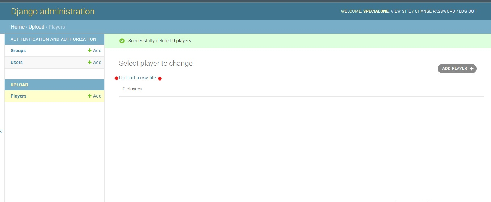
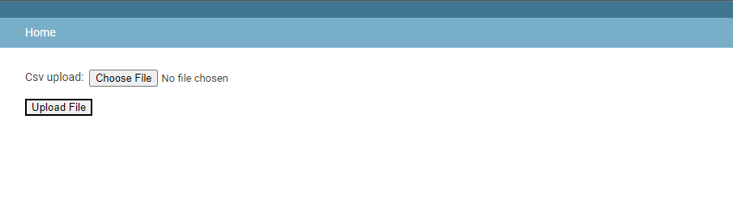
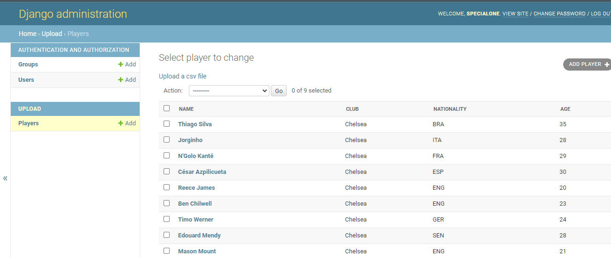
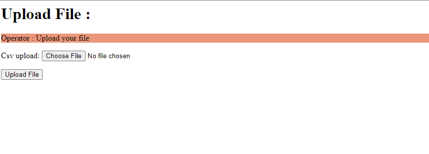

# django-csv
## Mini Project for Upload and Process csv files in django

 &nbsp;
 &nbsp;
  
  
  reqirements : django  
  install : pip install django
  
  Upload csv files from <b>Admin panel</b> or <b>Custom View</b>
  

  
  <h2>Admin Panel :</h2>

  <h4>upload a csv file :</h4>
  

  <h4>choose file</h4>
  

  <h4>created model's instances</h4>
  

  <h2>Custom View :</h2>
  
 
  
  

